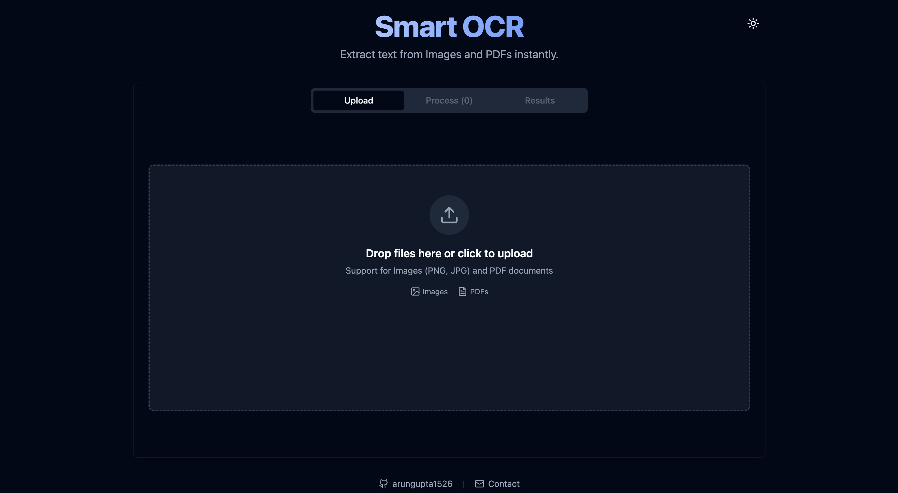
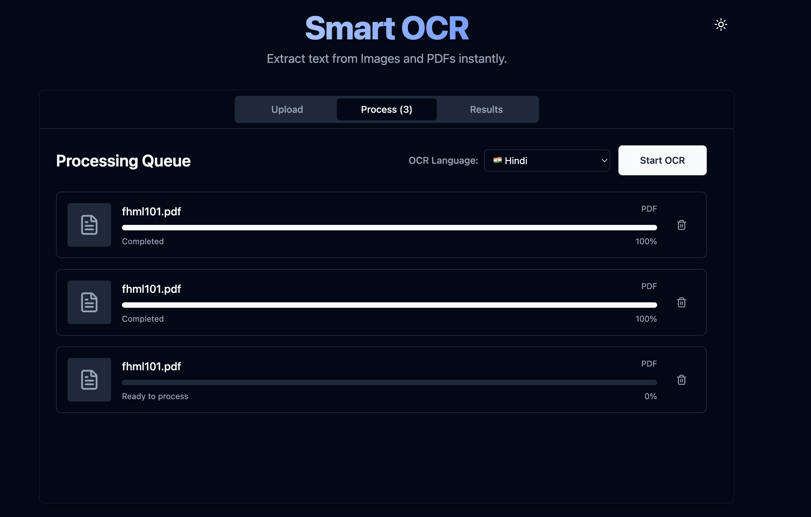
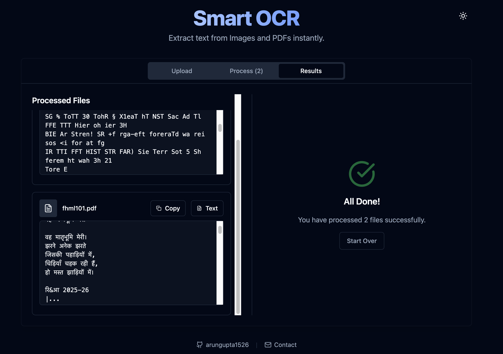

# 📄 Smart OCR Tool

A modern, fast, and powerful web-based OCR (Optical Character Recognition) tool that allows you to extract text from images and PDF documents instantly. Supports 12 languages including English, Hindi, and Arabic. Built with a focus on ease of use, speed, and a premium user experience.


🌐 **Live Demo**: [arungupta1526.github.io/ocr-tool/](https://arungupta1526.github.io/ocr-tool/)

## 📚 Table of Contents

- [📄 Smart OCR Tool](#-smart-ocr-tool)
  - [📚 Table of Contents](#-table-of-contents)
  - [📸 Screenshots](#-screenshots)
    - [Upload Interface](#upload-interface)
    - [OCR Processing](#ocr-processing)
    - [Extracted Text Results](#extracted-text-results)
  - [✨ Features](#-features)
  - [🏗 Architecture](#-architecture)
    - [Processing Flow](#processing-flow)
  - [⚡ Performance Considerations](#-performance-considerations)
    - [Per-File Abort Control](#per-file-abort-control)
    - [High Resolution Rendering](#high-resolution-rendering)
    - [Memory Management](#memory-management)
    - [Local Processing](#local-processing)
  - [🚀 Tech Stack](#-tech-stack)
  - [🛠️ Installation \& Setup](#️-installation--setup)
  - [📖 How to Use](#-how-to-use)
  - [🎯 Use Cases](#-use-cases)
  - [🤝 Contributing](#-contributing)
  - [🐳 Docker](#-docker)
  - [📜 License](#-license)

## 📸 Screenshots

### Upload Interface
Users can drag and drop images or PDF files directly into the upload area.



### OCR Processing
Real-time progress tracking for each file being processed.



### Extracted Text Results
View, copy, or download the extracted text after processing.



## ✨ Features

- **🖼️ Image OCR**: Extract text from PNG, JPG, JPEG, and WebP images.
- **📄 PDF Support**: Full support for multi-page PDF documents. Each page is processed individually.
- **🌍 Multi-Language Support**: Run OCR in 12 different languages (English, Hindi, Arabic, French, German, Chinese, etc.).
- **🚀 Real-time Progress**: Track the OCR progress for each file with visual progress bars.
- **⛔ Cancel Processing**: Cancel any individual file's OCR mid-way without stopping others.
- **💾 Download as Text**: Download the extracted text as a `.txt` file for easy editing and sharing.
- **📋 Instant Copy**: Copy extracted text to your clipboard with a single click (includes "Copied!" feedback).
- **✨ Modern UI**: A clean, responsive interface with smooth animations and dark mode support.
- **🛠️ Privacy First**: All processing happens locally in your browser using WebAssembly. Your files are never uploaded to a server.

## 🏗 Architecture

Smart OCR Tool runs entirely in the browser with no backend.

### Processing Flow

User Upload → Select Language → File Queue → OCR Engine → Extracted Text

1. User uploads images or PDFs.
2. User selects desired OCR language (e.g., English, Hindi).
3. Files enter a processing queue.
4. If a file is a PDF:
   - PDF.js renders pages to a canvas.
5. Canvas images are passed to Tesseract.js.
6. Tesseract performs OCR using WebAssembly.
7. Extracted text is displayed in the results panel.

```
User File
   ↓
Upload Queue
   ↓
PDF.js Rendering
   ↓
Canvas Image
   ↓
Tesseract.js OCR
   ↓
Extracted Text
```

## ⚡ Performance Considerations

### Per-File Abort Control
Each OCR job uses an `AbortController` so individual files can be cancelled without stopping the entire queue.

### High Resolution Rendering
PDF pages are rendered at **2× scale** before OCR to improve recognition accuracy.

### Memory Management
Canvas bitmaps are released after processing each page to avoid memory leaks when processing large PDFs.

### Local Processing
All OCR runs locally using WebAssembly, eliminating network latency and ensuring full privacy.


## 🚀 Tech Stack

- **Framework**: [React 19](https://react.dev/) + [TypeScript](https://www.typescriptlang.org/)
- **Build Tool**: [Vite](https://vitejs.dev/)
- **OCR Engine**: [Tesseract.js](https://tesseract.projectnaptha.com/)
- **PDF Handling**: [PDF.js](https://mozilla.github.io/pdf.js/)
- **Styling**: [Tailwind CSS v4](https://tailwindcss.com/)
- **Animations**: [Framer Motion](https://www.framer.com/motion/)
- **Icons**: [Lucide React](https://lucide.dev/)

## 🛠️ Installation & Setup

1. **Clone the repository**:
   ```bash
   git clone https://github.com/arungupta1526/ocr-tool.git
   cd ocr-tool
   ```

2. **Install dependencies**:
   ```bash
   npm install
   ```

3. **Run the development server**:
   ```bash
   npm run dev
   ```

4. **Build for production**:
   ```bash
   npm run build
   ```

## 📖 How to Use

1. **Upload**: Drag and drop your images or PDF files into the upload area, or click to browse.
2. **Language**: Select your document's language from the "OCR Language" dropdown (e.g., English, Hindi, Tamil).
3. **Process**: Once your files are in the queue, click the **"Start OCR"** button.
4. **Cancel** *(optional)*: Click the **✕** button next to any file to cancel its processing individually.
5. **Review**: Switch to the **"Results"** tab to view the extracted text for each file.
6. **Copy or Download**: Click **"Copy"** to copy text to clipboard, or **"Text"** to download as a `.txt` file.

## 🎯 Use Cases

- Extract text from scanned documents
- Convert image-based PDFs to editable text
- Quickly copy text from screenshots
- OCR for research papers or notes


## 🤝 Contributing

Contributions are welcome! If you have ideas for improvements or new features, feel free to open an issue or submit a pull request.

## 🐳 Docker

Want to self-host or run this in a container? See the **[Docker Guide](./DOCKER.md)** for full instructions including Dockerfile, build, run, and Docker Compose setup.

## 📜 License

Distributed under the MIT License. See `LICENSE` for more information.

---

Made with ❤️ by [Arun Gupta](https://github.com/arungupta1526)
